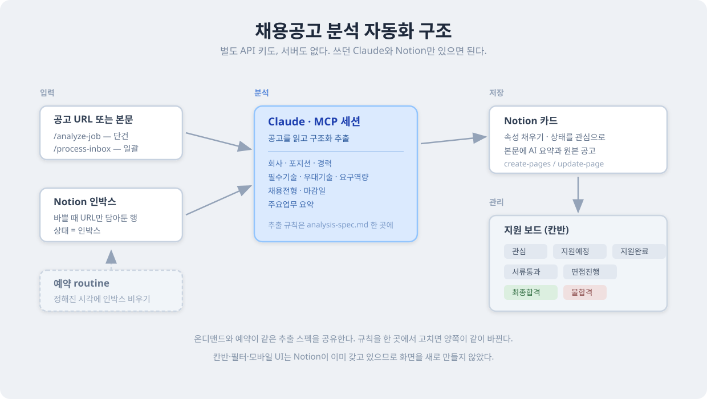

# 채용공고 분석 자동화 파이프라인 (Notion × MCP × Claude)

채용공고를 넣으면 Claude가 기술 스택·업무·요구역량을 분석해 Notion에 정리하고, 보드로 지원 현황을 관리하는 도구.

---

## 문제 → 해결

| 반복 작업 | 자동화 |
|-----------|--------|
| 공고를 읽고 요구 기술·업무를 손으로 정리 | Claude가 구조화 추출 (회사·포지션·경력·필수/우대 기술·요구역량·주요업무) |
| 스프레드시트에 지원 현황 수기 관리 | Notion 보드 뷰(상태 기준 칸반)로 관리 |
| 공고가 쌓이면 정리를 미루게 됨 | 예약 routine이 인박스(미분석) 공고를 주기적으로 자동 정리 |
| 공고가 쌓이면 어디부터 볼지 모르겠음 | 내 프로필 대비 요건 적합도를 컬럼에 채워둔다 (정렬은 Notion에서 직접) |

## 아키텍처



- **온디맨드** `/analyze-job <URL|본문>` — 공고 1건을 즉시 분석해 카드 생성
- **일괄** `/process-inbox` — 인박스(미분석) 행을 모아 한꺼번에 정리
- **예약** — 위 일괄 처리를 정해진 시각에 자동 실행 (선택, 현재 비활성)
- **적합도** `/score-jobs` — 프로필 대비 요건 적합도를 전 행에 다시 채움

규칙은 스펙 문서 두 개에 모여 있고, 명령들이 이를 공유한다. 한 곳에서 고치면 전부 같이 바뀐다.
- 추출·매핑: [`prompts/analysis-spec.md`](./prompts/analysis-spec.md) — `/analyze-job`, `/process-inbox`, 예약 routine
- 적합도 산정: [`prompts/fit-spec.md`](./prompts/fit-spec.md) — `/analyze-job`, `/score-jobs`

## Notion 데이터베이스 스키마

**채용공고 트래커** (개인 Notion 워크스페이스)

> 데모 스크린샷을 넣으려면 이 자리에 보드 뷰 이미지를 추가하세요. 예: ``

| 속성 | 타입 | 설명 |
|------|------|------|
| 회사명 | Title | |
| 포지션 | Text | |
| 상태 | Select | 인박스·관심·지원예정·지원완료·서류통과·면접진행·최종합격·불합격·**마감** |
| 경력 | Select | 무관·신입·1년+ … 5년+ |
| 필수기술 / 우대기술 / 요구역량 | Multi-select | AI 추출. **옵션은 자동 생성되지 않는다** — 없는 값은 먼저 옵션을 추가해야 한다 (아래 [한계](#한계)) |
| 채용전형 | Multi-select | AI가 추출한 전형 절차 (서류·코딩테스트·과제·1차·2차·임원면접·컬처핏) |
| 마감일 | Date | AI가 추출한 지원 마감일 (상시채용·미기재면 비움) |
| 주요업무 | Text | AI 요약 |
| 적합도 | Number | 내 프로필 대비 요건 적합도 0~100 ([규칙](./prompts/fit-spec.md)) |
| 적합도근거 | Text | 점수 산출 근거 한 줄 |
| URL / 지원일 / 메모 | URL · Date · Text | 사용자가 수기 관리 |
| 등록일 | Created time | 자동 |

**뷰**: `지원 보드`(board, 상태 그룹) · `인박스(미분석)`(table, 상태=인박스 필터) · `마감 임박`(table, 마감일 오름차순)

## 사용법

### 1) 온디맨드 단건 — `/analyze-job`
```
/analyze-job https://example-jobs.com/posting/12345
/analyze-job (공고 본문 붙여넣기)
```
→ 공고 1건을 분석해 Notion에 카드 생성, 생성된 페이지 링크를 반환.

### 2) 온디맨드 일괄 — `/process-inbox`
1. 바쁠 땐 Notion에서 공고 **URL만** 새 행에 담고 상태를 `인박스`로 둔다.
2. 나중에 `/process-inbox` 한 번이면 인박스(미분석) 행을 모아 한꺼번에 분석·정리하고 상태를 `관심`으로 바꾼다.

### 3) 적합도 채우기 — `/score-jobs`
1. `profile.example.md`를 `profile.md`로 복사해 연차·보유기술을 채운다(기술명은 DB 옵션명 그대로).
2. `/score-jobs` → 전체 행의 `적합도` 컬럼을 채운다.

`/analyze-job`으로 새로 등록하는 공고는 `profile.md`가 있으면 등록 시 자동 계산된다.

**정렬은 자동화하지 않는다.** 컬럼만 채워두고 정렬·필터는 Notion에서 직접 한다
(적합도 순으로 볼 사람은 컬럼 헤더로, 마감 임박 순으로 볼 사람은 기존 뷰로).

> **합격 확률이 아니다.** 실제 합격은 지원자 풀·TO·타이밍 같은 공고에 없는 변수에 좌우된다.
> 이 점수는 "쌓인 공고를 어디부터 볼지" 정하는 참고값이고, 규칙은 전부 결정적이라
> 같은 프로필·같은 공고면 항상 같은 값이 나온다. 자세한 규칙은 [`prompts/fit-spec.md`](./prompts/fit-spec.md).

### 4) 예약(선택) — 인박스 자동 처리
- 위 일괄 처리를 매일 정해진 시각에 **자동 실행**하는 claude.ai 클라우드 routine. **현재는 중단(비활성)** 상태.
- 설정·재활성화: [`routines/inbox-processor.md`](./routines/inbox-processor.md) 참고.

## 설계 노트

- **Notion 활용** — 칸반·필터·모바일 UI를 이미 제공하므로 프론트를 새로 만들지 않고 자동화에 집중.
- **Claude + MCP** — 별도 OpenAI 키·서버 없이 이미 쓰는 Claude로 분석(사용량은 소모), 명령들이 [스펙 문서](./prompts/)를 공유.
- **적합도는 LLM 판단이 아니라 규칙** — 점수를 LLM에 물으면 그럴듯하지만 근거가 없고, 재돌릴 때마다
  순위가 흔들려 정렬 기준으로 쓸 수 없다. 그래서 가중치 계산으로 고정하고 근거를 함께 남긴다.
- **정렬은 자동화하지 않는다** — 컬럼만 채운다. 자동화가 정렬 기준을 고정해버리면
  마감 임박 순으로 보고 싶을 때 방해만 된다.

## 프로젝트 구조

```
job-notion-automation/
├── README.md
├── .gitignore
├── profile.example.md          # 적합도 계산용 프로필 템플릿 (profile.md로 복사)
├── .claude/
│   └── commands/
│       ├── analyze-job.md      # 온디맨드 단건 /analyze-job
│       ├── process-inbox.md    # 온디맨드 일괄 /process-inbox
│       └── score-jobs.md       # 적합도 전수 재계산 /score-jobs
├── prompts/
│   ├── analysis-spec.md        # 추출·매핑 규칙 (Single Source of Truth)
│   └── fit-spec.md             # 적합도 산정 규칙 (Single Source of Truth)
└── routines/
    └── inbox-processor.md      # 예약 routine 프롬프트 + 설정법
```
> 명령을 쓰려면 위 파일들을 Claude Code 명령 경로
> (프로젝트 `.claude/commands/` 또는 `~/.claude/commands/`)에 두면 된다.

## 한계

- 현재 Notion 워크스페이스가 **무료 플랜**이라 인박스 행 조회(`query_*`)에 호출 한도가 있다.
  정리·수정은 제한이 없고, 조회는 fetch 폴백으로 대신한다.
- 사이트에 따라 페이지에서 공고 본문이 온전히 읽히지 않는다. 그럴 때는 추측해서 채우지 않고
  본문 붙여넣기로 처리한다.
- 멀티셀렉트(기술/역량 등) 새 옵션은 자동 추가되지 않아, 값 설정 전에 `update-data-source`로 먼저 옵션을 추가한다.
  옵션에 없는 기술은 속성에서 빠지고 본문 요약에만 남는다.
- **적합도는 프로필 품질을 그대로 물려받는다.** `profile.md`의 보유기술을 넉넉하게 적으면 대부분의 공고가
  필수 요건을 만족해 점수가 80점대에 뭉치고, 정렬이 무의미해진다. 실제로 쓴 기술만 적어야 변별력이 생긴다.
- **상태 변경을 트리거로 잡을 수 없다.** Notion의 속성 변경 자동화는 유료 플랜 기능이고 MCP에 자동화
  생성 도구가 없다. 그래서 `상태`를 옮길 때 `지원일`이 자동으로 채워지게 만들 수 없다 — 수기 입력이거나,
  두 속성을 한 번에 설정하는 Notion 버튼 속성을 쓰는 방법뿐이다.
